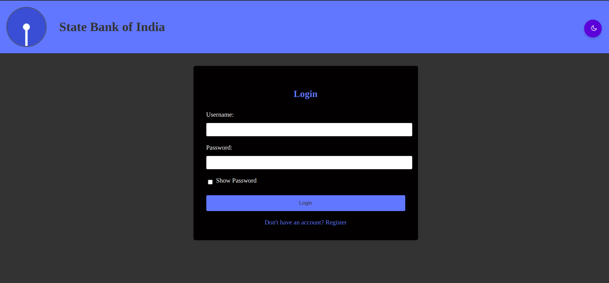
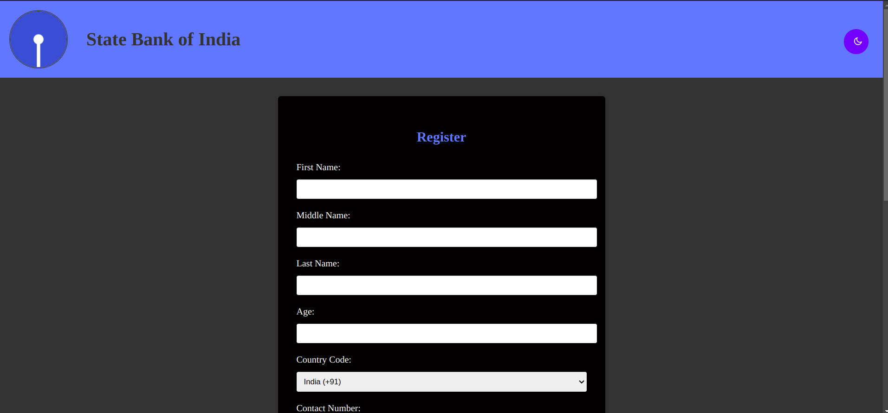
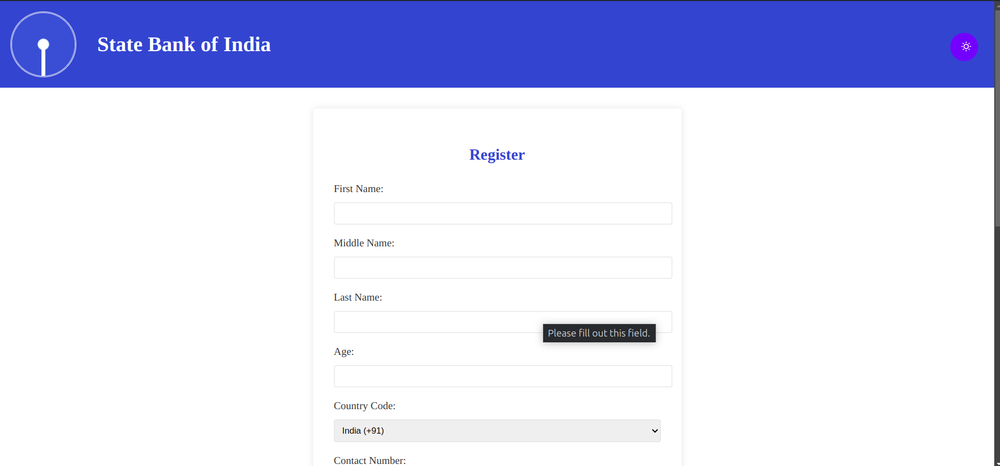

# Form Validation for User Registration - State Bank of India

This repository contains a simple **Form Validation** web application built using **HTML**, **CSS**, and **JavaScript**. The form is designed to validate user inputs for registration purposes at **State Bank of India (SBI)**. The form includes fields like name, email, phone number, password, and other personal details, with client-side validation to ensure data correctness before submission.

## Table of Contents
- [Project Overview](#project-overview)
- [Features](#features)
- [Technologies Used](#technologies-used)
- [Installation and Setup](#installation-and-setup)
- [Usage](#usage)
- [Screenshots](#screenshots)
- [License](#license)
- [Contact](#contact)

## Project Overview

This project provides a user-friendly registration form with validation checks to ensure:
- Correct name format (only alphabets).
- Valid email format (e.g., user@example.com).
- Phone number validation (only 10 digits).
- Strong password criteria (minimum length, combination of letters, numbers, and special characters).
- Password confirmation match.
- Optional fields for additional user details.

The website is live and can be accessed at the following URL:
> [Form Validation - State Bank of India](https://surya-kf.github.io/formvalidation/)

## Features

- **Responsive Design**: The form is responsive and works well across different devices.
- **Real-Time Validation**: Provides real-time feedback as the user enters data into the form fields.
- **Error Handling**: Displays error messages if the input does not meet the validation criteria.
- **Secure Form**: Encourages strong password policies for security.

## Technologies Used

- **HTML**: For the basic structure of the form.
- **CSS**: For styling the form to make it visually appealing.
- **JavaScript**: For adding validation functionality and interactivity to the form.

## Installation and Setup

1. Clone the repository:
   ```bash
   git clone https://github.com/surya-kf/formvalidation.git
   ```
2. Navigate to the project directory:
   ```bash
   cd formvalidation
   ```
3. Open `index.html` in your browser to view the registration form:
   ```bash
   open index.html
   ```

## Usage

1. **Form Fields**:
   - Name
   - Email
   - Phone Number
   - Age
   - Gender
   - Password
   - Confirm Password

2. **Validation Checks**:
   - Name: Must contain only alphabets.
   - Email: Must be in a valid email format.
   - Phone Number: Must be exactly 10 digits.
   - Password: Must have at least 8 characters, including uppercase, lowercase, numbers, and special characters.
   - Confirm Password: Must match the password.

3. **Submitting the Form**:
   Once all fields are filled out correctly and validation passes, the form can be submitted successfully.

## Screenshots





## License

This project is licensed under the MIT License - see the [LICENSE](LICENSE) file for details.

## Contact

For any inquiries or issues, feel free to reach out to the project maintainer:

- **KF Surya**
- **Email**: [kfsurya@example.com](mailto:kfsurya@example.com)
- **Address**: Avinashi Road, Arasur, Coimbatore, Tamil Nadu, 641407
